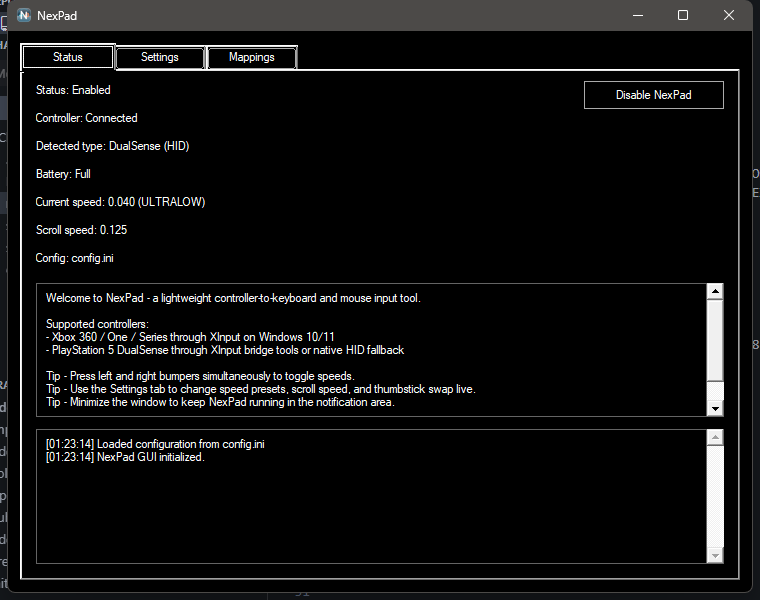
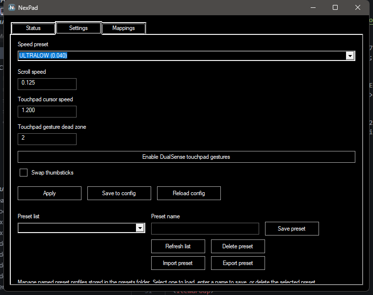
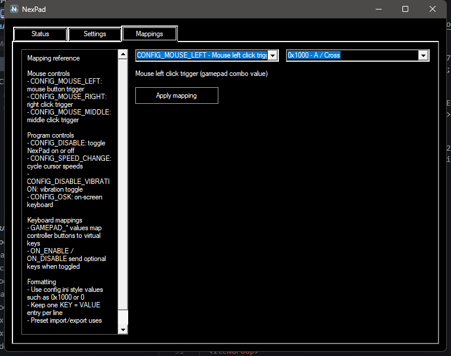

NexPad
======

[](https://github.com/pfchrono/NexPad/actions/workflows/build.yml)
[](https://github.com/pfchrono/NexPad/releases/latest)
[](https://github.com/pfchrono/NexPad/releases)

Controller-first desktop navigation for Windows.

NexPad is a lightweight Windows utility that maps controller input to mouse and keyboard actions for desktop navigation, media control, and couch-first PC use. It is designed for living-room PCs, handhelds, and setups where a gamepad is more practical than a keyboard and mouse.

Table of contents
=================

  * [Overview](#overview)
  * [Features](#features)
  * [Install](#install)
  * [Usage](#usage)
  * [Default Controls](#default-controls)
  * [Controller Support](#controller-support)
  * [Configuration](#configuration)
  * [DualSense Touchpad Support](#dualsense-touchpad-support)
  * [Screenshots](#screenshots)
  * [Build From Source](#build-from-source)
  * [GitHub Publishing](#github-publishing)
  * [License](#license)

Overview
======

NexPad turns a controller into a practical Windows input device. Analog sticks handle cursor movement and scrolling, buttons trigger clicks and keys, and the app stays small, fast, and configurable.

The current codebase includes:

* A native Windows configuration UI
* Preset save, load, import, and export support
* Xbox XInput controller support
* PlayStation HID fallback already integrated into the controller layer

Features
======

* Desktop cursor control from a controller
* DualSense one-finger touchpad cursor control plus two-finger scrolling through the native HID fallback path
* Scroll wheel emulation
* Mouse click mapping
* Keyboard mapping for controller buttons and triggers
* Enable and disable toggle shortcuts
* Preset save, load, import, and export support
* Small native Windows footprint with no runtime-heavy frontend stack

Install
======

Packaged builds can be distributed through the repository's Releases page once releases are published.

For a manual local setup:

1. Build or download `NexPad.exe`.
2. Keep `config.ini` next to the executable.
3. Keep the `presets/` folder next to the executable if you want preset management.
4. Launch `NexPad.exe` and connect a supported controller.

Requirements
======

NexPad targets Windows and depends on the Visual C++ runtime already expected by the Visual Studio toolchain. On up-to-date Windows 10 or 11 systems this is usually already available.

Usage
======

Typical usage flow:

1. Launch NexPad.
2. Connect an Xbox controller, or a PlayStation controller supported through the app's current HID path.
3. Move the mouse with the configured analog stick.
4. Use the Status tab to quickly enable or disable mapping.
5. Use the Settings and Mappings tabs to adjust live behavior and save presets.

If you want NexPad available at boot for a couch or HTPC setup, add a shortcut to your Startup folder after you confirm your config behaves the way you want.

Default Controls
======

NexPad automatically generates a config file with documentation for each binding.

* `A`: Left mouse click
* `X`: Right mouse click
* `Y`: Hide window or open the mapped OSK action depending on config
* `B`: Enter or mapped key action
* `D-pad`: Arrow keys
* `Left Analog`: Mouse movement
* `Left Analog Click`: Middle mouse click
* `Right Analog`: Scroll up and down
* `Right Analog Click`: `F2`
* `Back`: Browser refresh or mapped key action
* `Start`: Left Windows key or mapped key action
* `Start + Back`: Toggle NexPad on and off
* `Start + DPad Up`: Toggle vibration setting
* `LBumper`: Browser previous
* `RBumper`: Browser next
* `LBumper + RBumper`: Cycle speed presets
* `LTrigger`: Space
* `RTrigger`: Backspace

Controller Support
======

Xbox controllers

* Xbox 360 controllers through native XInput support
* Xbox One and newer XInput-compatible controllers
* Compatible third-party XInput controllers

PlayStation controllers

* PlayStation controllers may require XInput emulation tools in some setups
* The current codebase also includes native HID fallback logic for supported PlayStation devices
* DualSense touchpad cursor movement and two-finger scrolling are enabled by default for native HID-connected DualSense controllers and can be adjusted from the Settings tab or config, including speed and dead zone
* On Bluetooth DualSense connections, NexPad now requests enhanced HID reports automatically and falls back to simplified Bluetooth state parsing if full touchpad reports are unavailable

Third-party controllers

* Many third-party pads work if they present themselves as XInput-compatible devices
* Research your specific controller before relying on it for a living-room setup

Configuration
======

NexPad reads `config.ini` from the executable directory.

If you delete or break the active config file, NexPad can generate a fresh one on the next run.

Important config groups:

* `CONFIG_*`: controller actions such as mouse clicks, disable toggle, and OSK toggle
* `GAMEPAD_*`: keyboard mappings for controller buttons
* `ON_ENABLE` and `ON_DISABLE`: optional key events when mapping is toggled
* `CURSOR_SPEED`, `SCROLL_SPEED`, `SWAP_THUMBSTICKS`, and dead-zone values: movement behavior
* `TOUCHPAD_ENABLED`, `TOUCHPAD_DEAD_ZONE`, and `TOUCHPAD_SPEED`: DualSense touchpad mouse input behavior

DualSense touchpad support
======

NexPad can use the DualSense touchpad as an additional mouse and scroll input source when the controller is connected through the native HID fallback path.

Current scope:

* DualSense only
* one-finger cursor movement plus tap-to-click
* two-finger vertical and horizontal scrolling when reliable two-touch data is available
* additive to the existing stick mouse control
* enabled by default in the shipped config
* adjustable from the Settings tab or `config.ini`

Example config:

```ini
TOUCHPAD_ENABLED = 1
TOUCHPAD_DEAD_ZONE = 2
TOUCHPAD_SPEED = 1.200
```

The Settings tab now exposes touchpad enable, speed, and dead zone controls for live tuning and save or reload workflows. A short one-finger touchpad tap without pointer drag still triggers a left click, while a reliable two-finger gesture emits scroll wheel input without moving the cursor.

Reference links:

* Virtual Windows keys: https://msdn.microsoft.com/en-us/library/windows/desktop/dd375731
* XInput button values: https://msdn.microsoft.com/en-us/library/windows/desktop/microsoft.directx_sdk.reference.xinput_gamepad%28v=vs.85%29.aspx

If you create configs that are generally useful, add them under `Configs/` for sharing.

Screenshots
======

Actual NexPad UI captures:

Status tab:



Settings tab:



Mappings tab:



Build From Source
======

The Windows project targets the Visual Studio 2022 `v143` toolset.

Build from Visual Studio:

* Open `Windows/NexPad.sln`

Build from the command line with MSBuild:

```powershell
& 'C:\Program Files (x86)\Microsoft Visual Studio\2022\BuildTools\MSBuild\Current\Bin\MSBuild.exe' .\Windows\NexPad.sln /p:Configuration=Release /p:Platform=Win32
& 'C:\Program Files (x86)\Microsoft Visual Studio\2022\BuildTools\MSBuild\Current\Bin\MSBuild.exe' .\Windows\NexPad.sln /p:Configuration=Release /p:Platform=x64
```

Helper scripts:

* `scripts\build-all.bat` builds the full `Debug/Release x Win32/x64` matrix
* `scripts\build-all.bat clean` cleans each target before building
* `scripts\build-all.ps1` does the same from PowerShell
* `scripts\build-all.ps1 -Clean` cleans before building

Build output layout:

```text
debug/
  x32/
    NexPad.exe
    config.ini
    presets/
  x64/
    NexPad.exe
    config.ini
    presets/

release/
  x32/
    NexPad.exe
    config.ini
    presets/
    README.md
    LICENSE
  x64/
    NexPad.exe
    config.ini
    presets/
    README.md
    LICENSE
```

Intermediate objects, PDBs, libs, and tlogs are written under `Windows/.build/`.

Release Packaging
======

To build and package release artifacts locally:

```powershell
.\scripts\package-release.ps1 -Version v0.1.0
```

This generates zipped Win32 and x64 release artifacts under `artifacts/` using the same `release/x32` and `release/x64` layout produced by the Visual Studio project.

Each packaged zip also gets a matching SHA256 checksum file next to it:

* `NexPad-win32-<version>.zip.sha256`
* `NexPad-x64-<version>.zip.sha256`

The current release notes source for the published `v0.1.0` release lives in `docs/releases/v0.1.0.md`.

GitHub Publishing
======

This repository is published at `https://github.com/pfchrono/NexPad`.

Continuous integration is defined in `.github/workflows/build.yml` and will:

* build on pushes to `main`
* build on version tags matching `v*`
* run manually through `workflow_dispatch`
* upload packaged release zip files and checksum files as workflow artifacts
* attach packaged zip files and checksum files directly to GitHub Releases for tag builds

Typical publish flow:

1. Push the latest `main` branch.
2. Create and push a version tag such as `v0.1.1`:

```powershell
git tag v0.1.1
git push origin v0.1.1
```

3. Let the tag-triggered workflow publish the packaged assets to GitHub Releases.

For a manual release process, see `RELEASE_CHECKLIST.md`.

Spec-Driven Workflow
======

This repository is now initialized for Spec Kit with GitHub Copilot support.

Generated project workflow assets live under:

* `.specify/`
* `.github/prompts/`
* `.github/agents/`

Recommended NexPad workflow:

1. Start with `/speckit.constitution` to amend the project rules when needed.
2. Use `/speckit.specify` to write the feature spec in terms of user-visible behavior.
3. Use `/speckit.plan` to produce the implementation plan with actual NexPad file paths, build validation, and hardware regression checks.
4. Use `/speckit.tasks` to break the plan into actionable steps.
5. Use `/speckit.implement` to execute the approved tasks.

For NexPad changes, plans should explicitly cover:

* affected files under `Windows/NexPad/`
* required MSBuild validation
* manual controller hardware checks when input behavior changes
* config and README updates when runtime behavior changes

License
======

NexPad is free software: you can redistribute it and/or modify it under the terms of the GNU General Public License as published by the Free Software Foundation, either version 3 of the License, or (at your option) any later version.

This program is distributed in the hope that it will be useful, but WITHOUT ANY WARRANTY; without even the implied warranty of MERCHANTABILITY or FITNESS FOR A PARTICULAR PURPOSE. See the GNU General Public License for more details.

You should have received a copy of the GNU General Public License along with this program. If not, see http://www.gnu.org/licenses/.
